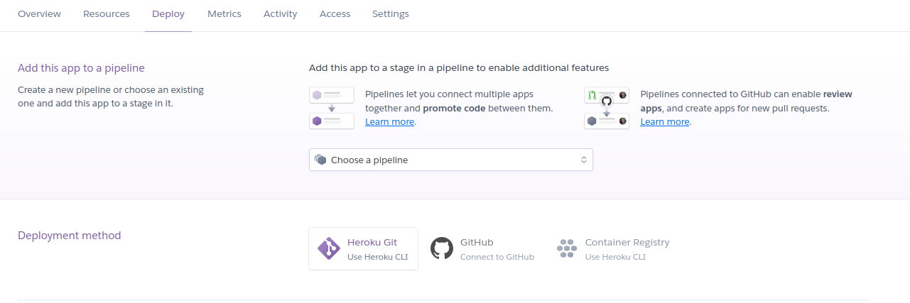

Para este hito he trabajado con heroku. Respecto al despliegue de la aplicación he visto que existen
tres formas fundamentales de realizarlo. 

- Utilizando [buildpacks](https://devcenter.heroku.com/articles/buildpacks)  especificos para el lenguaje
- Utilizando el archivo `heroku.yml` para especificar la construcción de un contenedor docker
- Construcción manual de un contenedor y publicarlo en el registro de heroku para despues hacer deploy del mismo.

Existe también la posibilidad de conectar un repositorio de github de manera que se haga deploy
de la aplicación cada vez que se haga push a una rama concreta

El uso del archivo `heroku.yml` permite una extensa descripción del entorno como se documenta [aqui](https://devcenter.heroku.com/articles/build-docker-images-heroku-yml). Además el entorno de addons de heroku es muy extenso y ofrece multitud de herramientas, la mayoria de forma gratuita.

